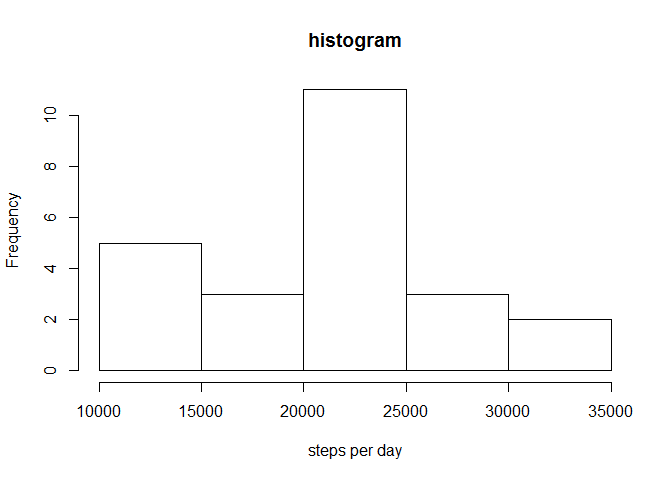
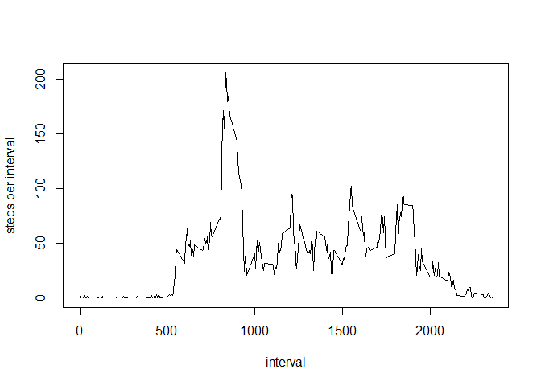
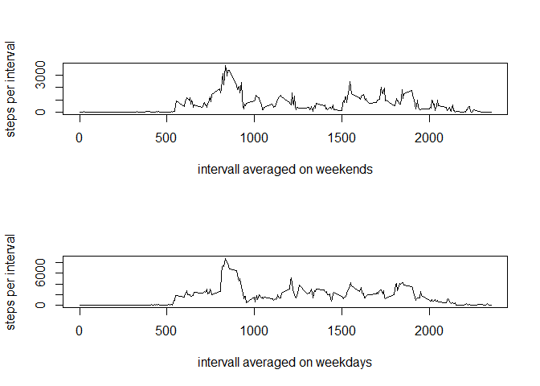

# Reproducible research course study assignment week 2
Sebastian Schmeck  
18 September 2017  


## Introduction

It is now possible to collect a large amount of data about personal movement using activity
monitoring devices such as a Fitbit, Nike Fuelband, or Jawbone Up. These type of devices are part
of the "quantified self" movement - a group of enthusiasts who take measurements about
themselves regularly to improve their health, to find patterns in their behavior, or because they
are tech geeks. But these data remain under-utilized both because the raw data are hard to obtain
and there is a lack of statistical methods and software for processing and interpreting the data.

This assignment makes use of data from a personal activity monitoring device. This device collects
data at 5 minute intervals through out the day. The data consists of two months of data from an
anonymous individual collected during the months of October and November, 2012 and include
the number of steps taken in 5 minute intervals each day.

The data for this assignment can be downloaded from the course web site:

- Dataset: Activity monitoring data [52K]


The variables included in this dataset are:

- steps: Number of steps taking in a 5-minute interval (missing values are coded as )
- date: The date on which the measurement was taken in YYYY-MM-DD format
- interval: Identifier for the 5-minute interval in which measurement was taken


The dataset is stored in a comma-separated-value (CSV) file and there are a total of 17,568
observations in this dataset.


## Loading the data

You can also embed plots, for example:


```r
library(readr)
activity <- read_csv("~/3. Training/2017-04 Data Science/5_reproducible research/week 2 assign/activity.csv", 
                     col_types = cols(date = col_date(format = "%Y-%M-%d"), 
                                      steps = col_double()))
```


## Histogram of number of steps per day


```r
stepsperday <- aggregate(activity$steps, list(Day=activity$date), FUN=sum)
hist(stepsperday$x, xlab = "steps per day", main = "histogram")
```

<!-- -->

## Calculate the mean and median of steps per day


```r
mean(stepsperday$x, na.rm = TRUE)
```

```
## [1] 21151.88
```

```r
median(stepsperday$x, na.rm = TRUE)
```

```
## [1] 21782
```

## Time series plot for 5 minutes interval and average number across all days


```r
stepsperinterval <- aggregate(activity$steps, list(Interval=activity$interval), mean, na.rm=TRUE)
plot(stepsperinterval$Interval, stepsperinterval$x, type = "l", xlab = "interval", ylab = "steps per interval")
```

<!-- -->


## Maximum of average steps in which interval


```r
stepsperinterval[which(stepsperinterval$x == max(stepsperinterval$x)),]
```

```
##     Interval        x
## 104      835 206.1698
```


## Calculate the total number of missing values in the dataset


```r
sum(is.na(activity$steps))
```

```
## [1] 2304
```


## Create a new dataset, filling in the missing data by the mean of that interval


```r
library(plyr)
impute.mean <- function(x) replace(x, is.na(x), mean(x, na.rm = TRUE))
activity_new <- ddply(activity, ~ interval, transform, steps = impute.mean(steps))
```


## Histogram of the total number of steps taken each day


```r
stepsperday_new <- aggregate(activity_new$steps, list(Day=activity_new$date), FUN=sum)
hist(stepsperday_new$x, xlab = "steps per day", main = "histogram 2")
```

<!-- -->


## Calculate and report the mean and median total number of steps taken per day


```r
mean(stepsperday_new$x)
```

```
## [1] 21185.08
```

```r
median(stepsperday_new$x)
```

```
## [1] 21641
```

Do these values differ from the first estimates? 

difference in mean (first - second estimate)


```r
mean(stepsperday$x, na.rm = TRUE) - mean(stepsperday_new$x)
```

```
## [1] -33.20595
```


difference in median (first - second estimate)


```r
median(stepsperday$x, na.rm = TRUE) - median(stepsperday_new$x)
```

```
## [1] 141
```

What is the impact of imputing missing data on the estimates of the total daily number of steps?


```r
(mean(stepsperday$x, na.rm = TRUE) - mean(stepsperday_new$x)) / mean(stepsperday$x, na.rm = TRUE) *100
```

```
## [1] -0.1569882
```

The mean average for the imputed missing data steps per day is about 13% lower then the original data without imputing.


## Differences in activity pattern between weekday and weekends


```r
activity_new$weekday <- weekdays(activity_new$date)
activity_new$weekday <- ifelse(weekdays(activity_new$date) %in% c("Samstag", "Sonntag"), "weekend", "weekday")
```


## Plot of weekdays vs. weekends average steps per 5minute intervall


```r
stepsperweekday <- aggregate(activity_new$steps, list(week=activity_new$weekday, interval=activity_new$interval), FUN=sum)
par(mfrow=c(2,1))
plot(stepsperweekday[which(stepsperweekday$week=="weekend"),2], stepsperweekday[which(stepsperweekday$week=="weekend"),3],
     xlab = "intervall averaged on weekends", ylab = "steps per interval", type = "l")
plot(stepsperweekday[which(stepsperweekday$week=="weekday"),2], stepsperweekday[which(stepsperweekday$week=="weekday"),3],
     xlab = "intervall averaged on weekdays", ylab = "steps per interval", type = "l")
```

<!-- -->

     
     


